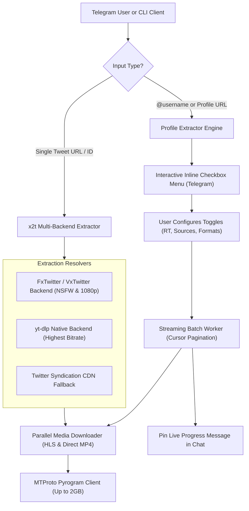

# ⚡ x2t (X-to-Telegram Media Engine & Bot)

> **High-Performance, Zero-Third-Party Twitter / X Media Extractor, Advanced Profile Scraper, and MTProto Telegram Bot (up to 2000 MB / 2 GB direct uploads).**

`x2t` is a modular, high-reliability Python engine and Telegram bot built to extract, download, and deliver media assets (Full HD/4K videos, original resolution photos, and looping GIFs) from any X/Twitter post or entire user profile with granular attribution filtering and real-time streaming delivery.

---

## 🌟 Key Highlights

- **🚀 MTProto 2000 MB (2 GB) File Delivery:** Integrated native MTProto client (`Pyrogram` + `TgCrypto`) allowing ultra-fast direct Telegram uploads up to **2 GB** per file, bypassing the standard 50 MB HTTP Bot API limit.
- **👤 Advanced Profile Downloader:** Enter any `@username` or profile URL to scan and download the user's entire timeline linearly with multi-page cursor pagination.
- **🎯 Granular Content & Attribution Filtering:**
  - 🔁 **Retweet / Repost Filter:** Exclude retweets by default so only original content is downloaded.
  - 🏷️ **Third-Party Sourced Media Filter (`From @other`):** Exclude tweets embedding another creator's video.
  - 💬 **Quote Tweet Filter:** Exclude quoted posts embedding secondary media.
  - 📹 🖼️ 🎞️ **Media Type Selector:** Selectively toggle Videos, Photos, or GIFs independently.
  - 🔢 **Batch Limits:** Customizable count (`♾️ All Available`, `10`, `25`, `50`, `100` posts).
- **📌 Interactive Telegram UI & Pinned Progress:**
  - Real-time inline checkbox toggles (`✅` / `❌`).
  - Automatic progress card pinned to the top of the chat with live post/file counters and a **`🛑 Stop / Cancel`** button.
- **🛡️ NSFW & Sensitive Content Resolution:** Custom resolver backend with persistent cookie management (`/set_cookie`) to unlock age-restricted and sensitive media seamlessly.
- **📦 Multi-Media Albums (MediaGroups):** Automatically bundles multi-photo/video tweets (up to 4 items) into clean native Telegram albums.
- **🧹 Zero-Waste Disk Lifecycle:** Downloaded temporary media files are automatically purged from disk immediately after delivery.
- **📊 SQLite Database & Admin Dashboard:** Tracks active users, download statistics, and includes `/stats` and `/broadcast` admin tools.

---

## 🏗️ Architecture



---

## 📦 Installation & Setup

### 1. Prerequisites
- Python 3.10+
- FFmpeg installed on your system (`sudo apt install ffmpeg`)

### 2. Clone Repository & Install
```bash
git clone https://github.com/TheMRVX/x2t.git
cd x2t

pip install -e .
```

### 3. Environment Configuration
Create a `.env` file from the template:

```bash
cp .env.example .env
```

Edit `.env` with your credentials:
```env
# Telegram Bot Configuration
BOT_TOKEN=123456789:ABCdefGhIJKlmNoPQRstuvWXyz
API_ID=your_api_id_here
API_HASH=your_api_hash_here
ADMIN_IDS=[123456789]
DB_PATH=bot_database.sqlite3
TEMP_DOWNLOAD_DIR=./downloads/temp_bot
RATE_LIMIT_SECONDS=2.0

# Optional: Twitter Auth Token for NSFW / Age-Restricted Profile Timelines
TWITTER_AUTH_TOKEN=your_auth_token_here
```

---

## 🤖 Running the Telegram Bot

### Direct Execution
```bash
python -m x2t.bot.main
```

### Docker Compose (Production)
```bash
docker compose up -d --build
```

View live logs:
```bash
docker compose logs -f
```

---

## 💻 CLI Usage

You can extract or download tweets directly from the command line:

```bash
# 1. Inspect tweet media links and metadata (without downloading)
x2t "https://x.com/username/status/1234567890"

# 2. Extract and download all media files to disk
x2t "https://x.com/username/status/1234567890" --download --output ./my_downloads

# 3. Output clean JSON metadata
x2t "https://x.com/username/status/1234567890" --json
```

---

## 🐍 Python Library SDK

Use `x2t` as a standalone Python package in your own projects:

```python
import asyncio
import x2t
from x2t.models import ProfileFilterOptions

# --- Single Tweet Extraction ---
result = x2t.extract_media("https://x.com/username/status/1234567890")
print(f"Author: {result.author_name} (@{result.author_username})")
print(f"Media Count: {result.media_count}")
for item in result.items:
    print(f" - {item.type}: {item.resolution} -> {item.url}")

# --- Single Tweet Download ---
downloaded = x2t.download_media("https://x.com/username/status/1234567890", output_dir="./downloads")
for item in downloaded.items:
    print(f"Downloaded to: {item.local_path} ({item.size_bytes} bytes)")

# --- Advanced Profile Streaming ---
async def stream_profile():
    from x2t.core.profile_extractor import profile_extractor
    
    options = ProfileFilterOptions(
        include_videos=True,
        include_photos=True,
        include_retweets=False,        # Exclude retweets
        include_sourced_media=False,   # Exclude 'From @other' videos
        include_quotes=False,          # Exclude quote tweets
        limit=0,                       # 0 = Unlimited streaming
    )
    
    async for post in profile_extractor.iter_profile_media_tweets_stream("NASA", options):
        print(f"Found Post {post.tweet_id} with {len(post.media_items)} media items.")

asyncio.run(stream_profile())
```

---

## ⚙️ Bot Commands & Admin Controls

| Command | Role | Description |
| :--- | :---: | :--- |
| `/start` | User | Welcome screen, bot feature overview, and instructions. |
| `/help` | User | Usage guide and troubleshooting tips. |
| `/about` | User | Version, architecture, and technology stack information. |
| `/stats` | Admin | Total registered users, total downloaded files, and 24h active users. |
| `/set_cookie <auth_token>` | Admin | Dynamically set or update Twitter `auth_token` for NSFW timelines. |
| `/broadcast <message>` | Admin | Broadcast an announcement message to all registered users. |

---

## 🧪 Testing

Run the full automated test suite (35 unit and integration tests):

```bash
pytest -v
```

---

## 👥 Contributors

- **TheMRVX Marvi** ([@TheMRVX](https://github.com/TheMRVX)) - Author & Lead Maintainer
- **Antigravity** ([Google DeepMind](https://deepmind.google/)) - AI Pair Programmer & Architecture Contributor

---

## 📄 License

This project is licensed under the **GNU Affero General Public License v3.0 (AGPL-3.0)** - see the [LICENSE](LICENSE) file for details.
