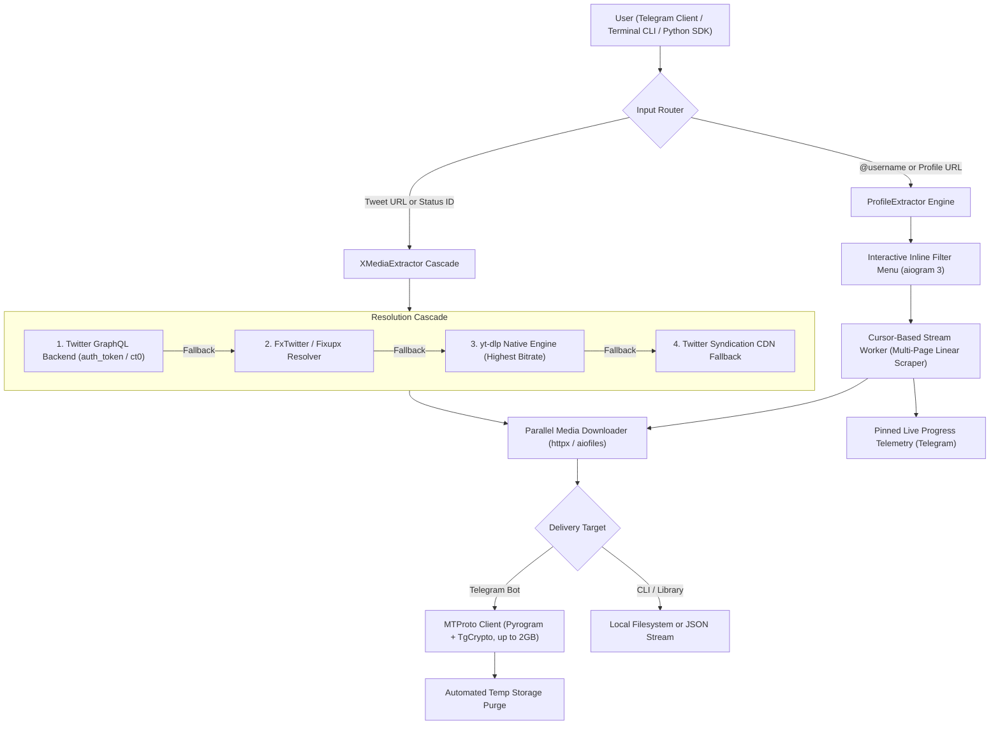

<div align="center">

# x2t

**A high-performance Twitter / X media extractor, profile timeline scraper, and MTProto Telegram bot with up to 2 GB direct uploads.**

[](LICENSE)


-0088cc)


[Overview](#overview) •
[Operating Modes](#operating-modes) •
[Architecture](#architecture) •
[Requirements](#requirements) •
[Installation](#installation) •
[Usage](#usage) •
[Bot Commands](#bot-commands) •
[Configuration](#configuration) •
[Troubleshooting](#troubleshooting) •
[FAQ](#faq) •
[License](#license)

<br/>

[English Documentation](README.md) • [راهنمای فارسی](README_FA.md)

</div>

---

## Overview

`x2t` is a modular media extraction engine and Telegram bot engineered to retrieve, download, and deliver media assets—including 4K / 1080p videos, original-resolution photos, and looping GIFs—from individual posts or entire creator timelines on X (formerly Twitter).

Standard Telegram bots rely on the HTTP Bot API, which enforces a strict 50 MB upload limit on outgoing media files. `x2t` addresses this bottleneck by integrating a native MTProto client (`Pyrogram` coupled with `TgCrypto` C-extensions). This architecture allows direct Telegram uploads of up to **2,000 MB (2 GB)** per file at line speed, while retaining an interactive `aiogram 3` interface for bot interactions.

Typical use cases:

- **Archiving High-Bitrate Media:** Fetching maximum-quality videos and original photos from X without platform compression.
- **Batch Profile Timeline Archiving:** Linear multi-page scraping of creator media feeds with granular attribution filters (omitting retweets, quote tweets, and external embeds).
- **Personal or Team Telegram Media Bot:** Running a private or public Telegram bot with real-time download tracking and native multi-media album formatting.
- **Headless Media Scraping:** Utilizing `x2t` as a CLI utility or Python library within automated archival pipelines.

> [!NOTE]
> `x2t` operates without mandatory Twitter API keys for public content. For age-restricted or sensitive (NSFW) media, it supports session cookie binding via configuration or live admin bot commands.

## Operating Modes

| Capability | MTProto Bot Mode (`x2t.bot`) | CLI Mode (`x2t`) | Python Library SDK (`import x2t`) |
|---|---|---|---|
| **Max File Upload** | **2,000 MB (2 GB)** via MTProto | Limited by local disk | Limited by caller handling |
| **Interface** | Telegram chat with inline controls | Terminal (Rich UI / JSON) | Programmatic async / sync API |
| **Profile Scraper** | Interactive menu + pinned progress | Direct stream processing | Async generator (`iter_profile_media_tweets_stream`) |
| **Media Grouping** | Native Telegram `MediaGroup` albums | File batches on disk | Pydantic objects (`PostMediaResult`) |
| **Storage Lifecycle** | Automatic temp disk cleanup post-upload | Persistent output directory | In-memory or specified directory |
| **Database & History** | SQLite (WAL mode) with `/history` & `/stats` | Stateless | Stateless |

## Architecture


```mermaid
flowchart TD
    User["User (Telegram Client / Terminal CLI / Python SDK)"] --> Router{"Input Router"}
    
    %% Single Tweet Flow
    Router -->|"Tweet URL or Status ID"| SingleEngine["XMediaExtractor Cascade"]
    subgraph Cascade ["Resolution Cascade"]
        B1["1. Twitter GraphQL Backend (auth_token / ct0)"]
        B2["2. FxTwitter / Fixupx Resolver"]
        B3["3. yt-dlp Native Engine (Highest Bitrate)"]
        B4["4. Twitter Syndication CDN Fallback"]
        B1 -->|Fallback| B2
        B2 -->|Fallback| B3
        B3 -->|Fallback| B4
    end
    SingleEngine --> Cascade
    Cascade --> DL["Parallel Media Downloader (httpx / aiofiles)"]
    
    %% Profile Pipeline Flow
    Router -->|"@username or Profile URL"| ProfileEngine["ProfileExtractor Engine"]
    ProfileEngine --> FilterUI["Interactive Inline Filter Menu (aiogram 3)"]
    FilterUI --> StreamWorker["Cursor-Based Stream Worker (Multi-Page Linear Scraper)"]
    StreamWorker --> PinnedUI["Pinned Live Progress Telemetry (Telegram)"]
    StreamWorker --> DL
    
    %% Delivery Layer
    DL --> Delivery{"Delivery Target"}
    Delivery -->|"Telegram Bot"| MTProto["MTProto Client (Pyrogram + TgCrypto, up to 2GB)"]
    Delivery -->|"CLI / Library"| Disk["Local Filesystem or JSON Stream"]
    MTProto --> Cleanup["Automated Temp Storage Purge"]
```

In short: The system classifies inputs into single-post lookups or profile queries. Single posts traverse a fault-tolerant multi-backend cascade (GraphQL → FxTwitter → yt-dlp → Syndication) to ensure retrieval even when specific endpoints face rate limits. Media assets are downloaded concurrently and uploaded directly to Telegram via MTProto, bypassing the 50 MB HTTP Bot API ceiling.

Repository layout:

```
x2t/
├── x2t/
│   ├── bot/             Telegram bot handlers, inline keyboards, and Pyrogram MTProto uploader
│   ├── core/            Extraction backends (GraphQL, FxTwitter, yt-dlp) and download engine
│   ├── utils/           Async SQLite database (WAL mode), TTL cache, and helpers
│   ├── __init__.py      Public Python SDK exports
│   ├── __main__.py      Rich CLI entry point
│   ├── config.py        Pydantic settings and environment management
│   ├── exceptions.py    Typed hierarchical exception system
│   ├── logger.py        Structured logging engine with Rich formatting
│   └── models.py        Pydantic domain models (PostMediaResult, MediaItem, ProfileFilterOptions)
├── docker-compose.yml   Production container orchestration
├── Dockerfile           Container definition with FFmpeg and build dependencies
├── pyproject.toml       Package metadata and dependencies (PEP 621)
└── requirements.txt     Direct package requirements
```

## Requirements

- **Python:** 3.10, 3.11, or 3.12 (64-bit recommended)
- **FFmpeg:** Installed and present in system `PATH` (required for video stream remuxing)
- **Telegram Credentials:**
  - `BOT_TOKEN` obtained from [@BotFather](https://t.me/BotFather)
  - `API_ID` and `API_HASH` obtained from [my.telegram.org](https://my.telegram.org) (enables MTProto 2 GB uploads)

## Installation

### 1. Clone Repository

```bash
git clone https://github.com/TheMRVX/x2t.git
cd x2t
```

### 2. Install Package & Dependencies

Create a virtual environment and install the package with dependencies:

```bash
python3 -m venv .venv
source .venv/bin/activate  # On Windows: .venv\Scripts\activate

pip install --upgrade pip
pip install -e .
```

Ensure system FFmpeg is available:

```bash
# Ubuntu / Debian
sudo apt update && sudo apt install -y ffmpeg

# macOS (Homebrew)
brew install ffmpeg

# Arch Linux
sudo pacman -S ffmpeg
```

### 3. Configure Environment

Copy the configuration template:

```bash
cp .env.example .env
```

Open `.env` and fill in your credentials:

```env
# Telegram Bot Configuration (Required)
BOT_TOKEN=123456789:ABCdefGhIJKlmNoPQRstuvWXyz
API_ID=12345678
API_HASH=0123456789abcdef0123456789abcdef

# Access Control
IS_PRIVATE=true
ADMIN_IDS=[123456789]
ALLOWED_USER_IDS=[]

# Storage & Database
DB_PATH=bot_database.sqlite3
TEMP_DOWNLOAD_DIR=./downloads/temp_bot
RATE_LIMIT_SECONDS=1.0

# Optional: Twitter Auth Cookie for Age-Restricted / NSFW Content
TWITTER_AUTH_TOKEN=
TWITTER_CT0=

# Optional: Caption Styling (true = minimal text without header/buttons)
CLEAN_CAPTION=false
```

## Usage

### Running the Telegram Bot

**Direct Execution:**

```bash
python -m x2t.bot.main
```

**Docker Compose (Production):**

```bash
docker compose up -d --build
```

View real-time application logs:

```bash
docker compose logs -f
```

---

### Command Line Interface (CLI)

The package provides a built-in command-line tool `x2t`:

```bash
# Inspect media links and post metadata without downloading
x2t "https://x.com/NASA/status/1835700854378123456"

# Extract and download media files to a designated folder
x2t "https://x.com/NASA/status/1835700854378123456" --download --output ./downloads

# Output structured JSON metadata for scripts and automation
x2t "https://x.com/NASA/status/1835700854378123456" --json

# Use cookies for protected or age-restricted tweets
x2t "https://x.com/username/status/1234567890" --download --cookies cookies.txt
```

---

### Python Library SDK

`x2t` can be integrated directly into Python applications:

#### Single Post Extraction & Download

```python
import x2t

# 1. Extract metadata and media URLs without downloading
result = x2t.extract_media("https://x.com/NASA/status/1835700854378123456")
print(f"Author: {result.author_name} (@{result.author_username})")
print(f"Total Media: {result.media_count}")

for item in result.items:
    print(f" - [{item.type.value.upper()}] {item.resolution or 'N/A'} -> {item.url}")

# 2. Download media files directly to disk
downloaded = x2t.download_media(
    "https://x.com/NASA/status/1835700854378123456",
    output_dir="./downloads"
)
for item in downloaded.items:
    print(f"Saved: {item.local_path} ({item.size_bytes} bytes)")
```

#### Asynchronous Download

```python
import asyncio
import x2t

async def main():
    result = await x2t.download_media_async(
        "https://x.com/NASA/status/1835700854378123456",
        output_dir="./downloads"
    )
    print(f"Downloaded {result.media_count} items asynchronously.")

asyncio.run(main())
```

#### Streaming Profile Timelines

```python
import asyncio
from x2t.core.profile_extractor import profile_extractor
from x2t.models import ProfileFilterOptions

async def archive_timeline():
    # Configure granular filtering
    options = ProfileFilterOptions(
        include_videos=True,
        include_photos=True,
        include_gifs=True,
        include_retweets=False,        # Exclude retweets / reposts
        include_sourced_media=False,   # Exclude third-party 'From @other' embeds
        include_quotes=False,          # Exclude quote tweets
        limit=50,                      # 0 = Unlimited
    )

    async for post in profile_extractor.iter_profile_media_tweets_stream("NASA", options):
        print(f"Post {post.tweet_id}: {len(post.media_items)} media items found")
        for item in post.media_items:
            print(f"  -> {item.type.value}: {item.url}")

asyncio.run(archive_timeline())
```

## Bot Commands

| Command | Scope | Description |
|---|---|---|
| `/start` | Public | Welcome screen, bot overview, and quick-start instructions |
| `/history` | Public | View the last 5 downloaded posts with direct URLs |
| `/help` | Public | Usage guide, supported links, and troubleshooting details |
| `/about` | Public | System architecture, version info, and engine specifications |
| `/mode [private\|public]` | Admin | View or dynamically toggle access control mode |
| `/caption [clean\|full]` | Admin | Toggle caption styling between clean text and detailed card |
| `/stats` | Admin | Display user count, total downloads, and system telemetry |
| `/allow <user_id>` | Admin | Grant access to a Telegram user ID when in Private mode |
| `/disallow <user_id>` | Admin | Revoke access for a previously authorized user ID |
| `/set_cookie <auth_token>` | Admin | Dynamically set Twitter session cookie for NSFW unlocking |
| `/broadcast <message>` | Admin | Broadcast an announcement to all registered bot users |

## Configuration

All configuration parameters can be set via `.env` or system environment variables:

| Parameter | Type | Required | Default | Description |
|---|---|---|---|---|
| `BOT_TOKEN` | String | **Yes** | — | Telegram Bot API token from [@BotFather](https://t.me/BotFather) |
| `API_ID` | Integer | **Yes** | — | Telegram MTProto API ID from [my.telegram.org](https://my.telegram.org) |
| `API_HASH` | String | **Yes** | — | Telegram MTProto API Hash from [my.telegram.org](https://my.telegram.org) |
| `IS_PRIVATE` | Boolean | No | `false` | When `true`, restricts bot usage to `ADMIN_IDS` and `ALLOWED_USER_IDS` |
| `ADMIN_IDS` | JSON List | No | `[]` | List of Telegram user IDs with administrative privileges |
| `ALLOWED_USER_IDS` | JSON List | No | `[]` | Whitelisted Telegram user IDs permitted in private mode |
| `TWITTER_AUTH_TOKEN` | String | No | — | Twitter `auth_token` cookie for age-restricted / sensitive content |
| `TWITTER_CT0` | String | No | — | Twitter CSRF token (`ct0`) companion cookie |
| `CLEAN_CAPTION` | Boolean | No | `false` | When `true`, omits author details and action buttons from captions |
| `DB_PATH` | Path | No | `bot_database.sqlite3` | SQLite database filepath (operated with WAL concurrency) |
| `TEMP_DOWNLOAD_DIR` | Path | No | `./downloads/temp_bot` | Ephemeral storage path during active MTProto uploads |
| `RATE_LIMIT_SECONDS` | Float | No | `1.0` | Per-user rate limit cooldown interval in seconds |

## Troubleshooting

| Symptom | Likely Cause | Solution |
|---|---|---|
| `FloodWait` error on upload | Telegram MTProto rate-limiting on rapid uploads | The bot handles wait times automatically; avoid parallel mass downloads across many chats. |
| Age-restricted tweet fails extraction | Twitter enforces login verification for sensitive content | Supply `TWITTER_AUTH_TOKEN` in `.env` or execute `/set_cookie <token>` in the bot. |
| `ffmpeg: command not found` | FFmpeg missing from system environment | Install FFmpeg via your OS package manager and ensure it is in system `PATH`. |
| Bot ignores messages from users | `IS_PRIVATE=true` is enabled without user authorization | Add user ID to `ALLOWED_USER_IDS` or use `/allow <user_id>` via an admin account. |
| Profile downloader yields zero results | User timeline has no media or profile is private/suspended | Verify username accessibility directly on X; private accounts require auth tokens. |

## FAQ

**Why does x2t require `API_ID` and `API_HASH` in addition to `BOT_TOKEN`?**  
Standard Telegram Bot API endpoints restrict uploads to 50 MB. By connecting through Telegram's native MTProto protocol using `API_ID` and `API_HASH`, `x2t` unlocks direct 2,000 MB (2 GB) file transfers.

**Are Twitter developer API keys required?**  
No. `x2t` utilizes public syndication interfaces, FxTwitter endpoints, and yt-dlp resolvers to extract media without paid Twitter API credentials.

**Is disk space conserved during large batch downloads?**  
Yes. Temporary media files stored in `TEMP_DOWNLOAD_DIR` are automatically purged from disk immediately upon successful delivery to Telegram.

**Can I run the bot in public Telegram groups or channels?**  
Yes. Set `IS_PRIVATE=false` in `.env` to allow public usage, or keep `IS_PRIVATE=true` to restrict usage exclusively to administrators and whitelisted accounts.

## Contributing

Contributions, bug reports, and feature requests are welcome.

1. Fork the repository.
2. Create a feature branch (`git checkout -b feat/my-feature`).
3. Commit your changes adhering to [Conventional Commits](https://www.conventionalcommits.org/) (`git commit -m "feat: add feature"`).
4. Run tests (`pytest tests/`).
5. Open a Pull Request.

## License

Distributed under the **GNU Affero General Public License v3.0 or later** (`AGPL-3.0-or-later`). See [LICENSE](LICENSE) for complete terms.
