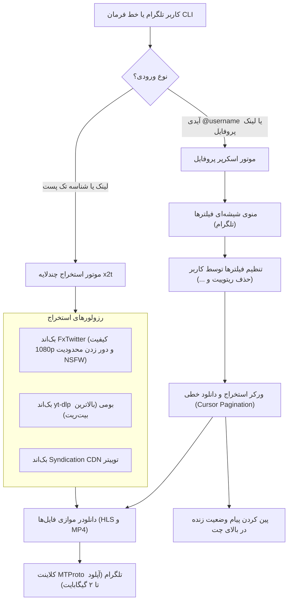

# ربات و موتور دانلود مدیا x2t (توییتر / X به تلگرام)

<p align="center">
  
</p>

<p align="center">
  <a href="README.md">English Documentation</a> •
  <a href="README_FA.md">راهنمای فارسی</a>
</p>

> موتور پرسرعت و مستقل استخراج و دانلود مدیا از توییتر (X)، اسکرپر پیشرفته تایم‌لاین پروفایل، و ربات تلگرام با آپلود مستقیم ۲ گیگابایتی (MTProto) — ساخته شده با Google Antigravity.

پروژه `x2t` یک موتور ماژولار پایتون به همراه ربات تلگرام است که برای استخراج، دانلود و ارسال انواع مدیا (ویدیوهای با کیفیت 1080p و 4K، تصاویر با رزولوشن اصلی و گیف‌های تکرارشونده) از پست‌های تکی یا کل تایم‌لاین پروفایل‌های توییتر طراحی شده است.

---

## قابلیت‌های فنی

- **ارسال مستقیم فایل تا ۲ گیگابایت (MTProto):** مجهز به کلاینت بومی MTProto تلگرام (`Pyrogram` + `TgCrypto`) جهت آپلود فایل‌های حجیم تا سقف ۲۰۰۰ مگابایت (2GB) و عبور از محدودیت ۵۰ مگابایتی Bot API استاندارد.
- **دانلودر پیشرفته تایم‌لاین پروفایل:** استخراج و دانلود خطی تایم‌لاین کاربر به صورت چندصفحه‌ای (Cursor Pagination) با ارسال شناسه کاربری یا آدرس پروفایل.
- **فیلترهای دقیق محتوا:**
  - **فیلتر ریتوییت (Retweet):** حذف پیش‌فرض بازنشرها جهت دریافت محتوای اختصاصی اکانت.
  - **فیلتر ویدیوهای شخص ثالث (`From @other`):** حذف توییت‌های دارای مدیای امبدشده از سایر حساب‌ها.
  - **فیلتر نقل‌قول (Quote Tweets):** حذف توییت‌های نقل‌قول حاوی مدیای ثانویه.
  - **تفکیک فرمت‌ها:** انتخاب مجزای ویدیوها، عکس‌ها یا گیف‌ها.
  - **تعیین سقف دریافت:** امکان دانلود نامحدود یا انتخاب مقادیر ۱۰، ۲۵، ۵۰ و ۱۰۰ پست.
- **رابط کاربری تعاملی و پیام وضعیت پین‌شده:**
  - دکمه‌های شیشه‌ای وضعیت فیلترها.
  - پین شدن خودکار وضعیت زنده با شمارنده پست‌ها/فایل‌ها و دکمه لغو و توقف عملیات.
- **بازگشایی خودکار محتوای حساس و دارای محدودیت سنی (NSFW):** پشتیبانی از کوکی احراز هویت توییتر و دریافت خودکار توکن CSRF (`ct0`) به همراه دستور داینامیک `/set_cookie`.
- **ارسال آلبومی (MediaGroup):** تجمیع خودکار پست‌های چندرسانه‌ای در قالب آلبوم‌های تلگرام.
- **پاکسازی خودکار دیسک:** حذف خودکار فایل‌های موقت بلافاصله پس از ارسال به تلگرام.
- **کنترل دسترسی (حالت عمومی و خصوصی):** امکان محدودسازی دسترسی به ادمین و کاربران مجاز (`IS_PRIVATE=true`).

---

## معماری سیستم



---

## نصب و راه‌اندازی

### ۱. پیش‌نیازها
- پایتون ۳.۱۰ یا بالاتر (`Python 3.10+`)
- ابزار FFmpeg بر روی سیستم (`sudo apt install ffmpeg`)

### ۲. کلون کردن مخزن و نصب پکیج
```bash
git clone https://github.com/TheMRVX/x2t.git
cd x2t

pip install -e .
```

### ۳. تنظیم متغیرهای محیطی (`.env`)
فایل نمونه را کپی کرده و اطلاعات خود را وارد کنید:

```bash
cp .env.example .env
```

محتوای فایل `.env`:
```env
# تنظیمات ربات تلگرام
BOT_TOKEN=123456789:ABCdefGhIJKlmNoPQRstuvWXyz
API_ID=your_api_id_here
API_HASH=your_api_hash_here

# کنترل دسترسی: true = حالت خصوصی (فقط ادمین)، false = عمومی (آزاد برای همه)
IS_PRIVATE=true
ADMIN_IDS=[123456789]
ALLOWED_USER_IDS=[]

DB_PATH=bot_database.sqlite3
TEMP_DOWNLOAD_DIR=./downloads/temp_bot
RATE_LIMIT_SECONDS=1.0

# اختیاری: کوکی توییتر جهت بازگشایی تایم‌لاین اکانت‌های دارای محدودیت سنی و حساس (NSFW)
TWITTER_AUTH_TOKEN=your_auth_token_here

# اختیاری: ارسال ساده و بدون نام نویسنده/دکمه (true = فقط متن خام توییت)
CLEAN_CAPTION=true
```

---

## اجرای ربات تلگرام

### روش اول: اجرای مستقیم با پایتون
```bash
python -m x2t.bot.main
```

### روش دوم: اجرا با داکر کامپوز (پیشنهادی برای سرور)
```bash
docker compose up -d --build
```

مشاهده لاگ‌های زنده:
```bash
docker compose logs -f
```

---

## استفاده از طریق خط فرمان (CLI)

می‌توانید هر توییت را مستقیماً از طریق ترمینال بررسی یا دانلود کنید:

```bash
# ۱. استخراج لینک‌های مستقیم و متادیتا (بدون دانلود فایل)
x2t "https://x.com/username/status/1234567890"

# ۲. دانلود کامل فایل‌ها درون یک پوشه مشخص
x2t "https://x.com/username/status/1234567890" --download --output ./my_downloads

# ۳. خروجی به صورت داده ساختاریافته JSON
x2t "https://x.com/username/status/1234567890" --json
```

---

## استفاده در پروژه‌های پایتون (Python SDK)

می‌توانید از `x2t` به عنوان یک کتابخانه در کدهای پایتون خود استفاده کنید:

```python
import asyncio
import x2t
from x2t.models import ProfileFilterOptions

# --- استخراج لینک‌ها و متادیتا ---
result = x2t.extract_media("https://x.com/username/status/1234567890")
print(f"Author: {result.author_name} (@{result.author_username})")
print(f"Media Count: {result.media_count}")
for item in result.items:
    print(f" - {item.type}: {item.resolution} -> {item.url}")

# --- دانلود کامل مدیا در دیسک ---
downloaded = x2t.download_media("https://x.com/username/status/1234567890", output_dir="./downloads")
for item in downloaded.items:
    print(f"Downloaded to: {item.local_path} ({item.size_bytes} bytes)")

# --- استخراج جریانی تایم‌لاین پروفایل ---
async def stream_profile():
    from x2t.core.profile_extractor import profile_extractor
    
    options = ProfileFilterOptions(
        include_videos=True,
        include_photos=True,
        include_retweets=False,        # حذف ریتوییت‌ها
        include_sourced_media=False,   # حذف ویدیوهای شخص ثالث
        include_quotes=False,          # حذف نقل‌قول‌ها
        limit=0,                       # ۰ = استخراج نامحدود
    )
    
    async for post in profile_extractor.iter_profile_media_tweets_stream("NASA", options):
        print(f"Found Post {post.tweet_id} with {len(post.media_items)} media items.")

asyncio.run(stream_profile())
```

---

## دستورات ربات و پنل مدیریت

| دستور | سطح دسترسی | توضیحات |
| :--- | :---: | :--- |
| `/start` | کاربر | پیام شروع، معرفی قابلیت‌ها و راهنمای استفاده. |
| `/history` | کاربر | نمایش ۵ دانلود اخیر کاربر با لینک مستقیم. |
| `/help` | کاربر | راهنمای استفاده و رفع اشکال. |
| `/about` | کاربر | اطلاعات نسخه، معماری و فناوری‌های مورد استفاده. |
| `/mode [private/public]` | ادمین | مشاهده یا تغییر وضعیت دسترسی به حالت عمومی یا خصوصی. |
| `/caption [clean/full]` | ادمین | تغییر حالت کپشن به متن ساده بدون دکمه و نام نویسنده. |
| `/stats` | ادمین | آمار کلی کاربران، تعداد کل دانلودها و وضعیت اتصال توییتر. |
| `/allow <user_id>` | ادمین | افزودن شناسه عددی کاربر به لیست مجاز در حالت خصوصی. |
| `/disallow <user_id>` | ادمین | حذف دسترسی کاربر مشخص‌شده. |
| `/set_cookie <auth_token>` | ادمین | ثبت یا به‌روزرسانی کوکی احراز هویت توییتر برای محتوای حساس. |
| `/broadcast <message>` | ادمین | ارسال پیام همگانی به تمامی کاربران ربات. |
