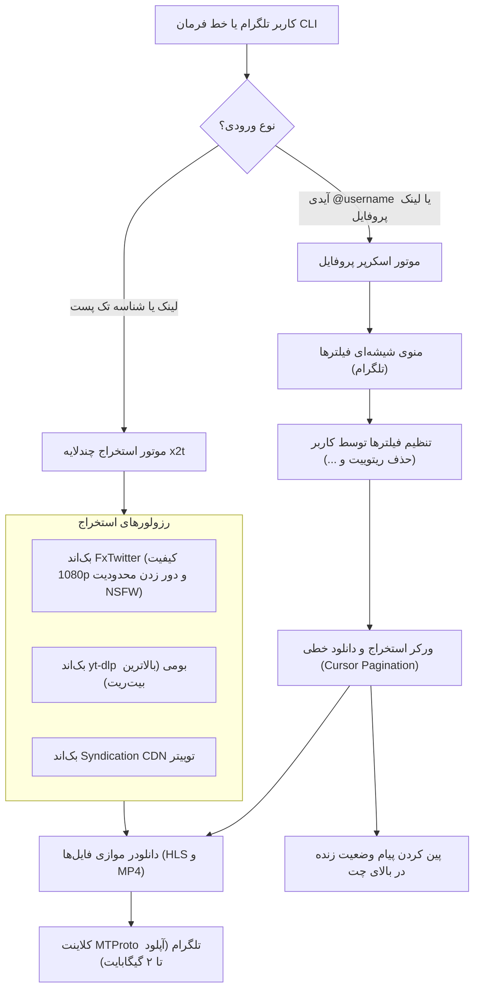

# ⚡ ربات و موتور دانلود مدیا x2t (توییتر / X به تلگرام)

<p align="center">
  <a href="README.md">🇬🇧 English Documentation</a> •
  <a href="README_FA.md">🇮🇷 راهنمای فارسی</a>
</p>

> **موتور پرسرعت و مستقل استخراج و دانلود مدیا از توییتر (X)، اسکرپر پیشرفته تایم‌لاین پروفایل، و ربات تلگرام با آپلود مستقیم ۲ گیگابایتی (MTProto).**

پروژه `x2t` یک موتور قدرتمند و ماژولار پایتون به همراه ربات تلگرام است که برای استخراج، دانلود و ارسال انواع مدیا (ویدیوهای با کیفیت 1080p و 4K، تصاویر با رزولوشن اصلی `orig` و گیف‌های تکرارشونده) از پست‌های تکی یا کل تایم‌لاین پروفایل‌های توییتر طراحی شده است.

---

## 🌟 قابلیت‌های برجسته

- **🚀 ارسال مستقیم فایل تا ۲ گیگابایت (MTProto):** مجهز به کلاینت بومی MTProto تلگرام (`Pyrogram` + `TgCrypto`) جهت آپلود فوق‌سریع فایل‌های حجیم تا سقف **۲۰۰۰ مگابایت (2GB)** و عبور از محدودیت ۵۰ مگابایتی Bot API استاندارد.
- **👤 دانلودر پیشرفته تایم‌لاین پروفایل:** با ارسال آیدی (`@username`) یا لینک پروفایل، تمام تایم‌لاین کاربر به صورت خطی و چندصفحه‌ای (Cursor Pagination) استخراج و دانلود می‌شود.
- **🎯 فیلترهای دقیق و هوشمند محتوا:**
  - 🔁 **فیلتر ریتوییت (Retweet):** حذف پیش‌فرض بازنشرها جهت دریافت تنها پست‌های اختصاصی خود اکانت.
  - 🏷️ **فیلتر ویدیوهای دیگران (`From @other`):** حذف توییت‌هایی که ویدیوی اکانت‌های دیگر را امبد کرده‌اند.
  - 💬 **فیلتر نقل‌قول (Quote Tweets):** حذف توییت‌های نقل‌قول حاوی مدیای ثانویه.
  - 📹 🖼️ 🎞️ **تفکیک فرمت‌ها:** امکان انتخاب دلخواه برای دریافت فقط ویدیوها، فقط عکس‌ها یا فقط گیف‌ها.
  - 🔢 **تعیین سقف دریافت:** امکان دانلود نامحدود (`♾️ همه پست‌های اکانت`) یا انتخاب مقادیر دلخواه (۱۰، ۲۵، ۵۰، ۱۰۰ پست).
- **📌 رابط کاربری تعاملی تلگرام و نوار پیشرفت پین‌شده:**
  - دکمه‌های شیشه‌ای وضعیت (`✅` و `❌`).
  - پین شدن خودکار پیام پیشرفت در بالای چت به همراه شمارنده زنده تعداد پست‌ها/فایل‌ها و دکمه **`🛑 لغو و توقف عملیات`**.
- **🔞 بازگشایی خودکار اکانت‌های حساس و NSFW:** پشتیبانی از نشست‌های احراز هویت توییتر و دریافت خودکار توکن امنیتی CSRF (`ct0`) به همراه دستور داینامیک `/set_cookie`.
- **📦 ارسال آلبومی (MediaGroup):** تجمیع خودکار پست‌های چندرسانه‌ای (تا ۴ عکس/ویدیو) در قالب آلبوم منظم تلگرام.
- **🧹 پاکسازی خودکار دیسک:** حذف آنی فایل‌های موقت دانلودشده بلافاصله پس از ارسال به تلگرام.
- **🔒 امنیت و کنترل دسترسی (حالت عمومی و خصوصی):** امکان خصوصی‌سازی ربات (`IS_PRIVATE=true`) تا فقط ادمین‌ها و افراد مجاز امکان استفاده داشته باشند.

---

## 🏗️ معماری سیستم



---

## 📦 نصب و راه‌اندازی

### ۱. پیش‌نیازها
- پایتون ۳.۱۰ یا بالاتر (`Python 3.10+`)
- ابزار FFmpeg بر روی سیستم (`sudo apt install ffmpeg`)

### ۲. کلون کردن مخزن و نصب پکیج
```bash
git clone https://github.com/TheMRVX/x2t.git
cd x2t

pip install -e .
```

### ۳. تنظیم متغیرهای محیطی (`.env`)
فایل نمونه را کپی کرده و اطلاعات خود را وارد کنید:

```bash
cp .env.example .env
```

محتوای فایل `.env`:
```env
# تنظیمات ربات تلگرام
BOT_TOKEN=123456789:ABCdefGhIJKlmNoPQRstuvWXyz
API_ID=your_api_id_here
API_HASH=your_api_hash_here

# کنترل دسترسی: true = حالت خصوصی (فقط ادمین)، false = عمومی (آزاد برای همه)
IS_PRIVATE=true
ADMIN_IDS=[123456789]
ALLOWED_USER_IDS=[]

DB_PATH=bot_database.sqlite3
TEMP_DOWNLOAD_DIR=./downloads/temp_bot
RATE_LIMIT_SECONDS=2.0

# اختیاری: کوکی توییتر جهت بازگشایی تایم‌لاین اکانت‌های دارای محدودیت سنی و حساس (NSFW)
TWITTER_AUTH_TOKEN=your_auth_token_here
```

---

## 🤖 اجرای ربات تلگرام

### روش اول: اجرای مستقیم با پایتون
```bash
python -m x2t.bot.main
```

### روش دوم: اجرا با داکر کامپوز (پیشنهادی برای سرور)
```bash
docker compose up -d --build
```

مشاهده لاگ‌های زنده:
```bash
docker compose logs -f
```

---

## 💻 استفاده از طریق خط فرمان (CLI)

می‌توانید هر توییت را مستقیماً از طریق ترمینال بررسی یا دانلود کنید:

```bash
# ۱. استخراج لینک‌های مستقیم و متادیتا (بدون دانلود فایل)
x2t "https://x.com/username/status/1234567890"

# ۲. دانلود کامل فایل‌ها درون یک پوشه مشخص
x2t "https://x.com/username/status/1234567890" --download --output ./my_downloads

# ۳. خروجی به صورت داده ساختاریافته JSON
x2t "https://x.com/username/status/1234567890" --json
```

---

## 🐍 استفاده در پروژه‌های پایتون (Python SDK)

می‌توانید از `x2t` به عنوان یک کتابخانه در کدهای پایتون خود استفاده کنید:

```python
import asyncio
import x2t
from x2t.models import ProfileFilterOptions

# --- ۱. استخراج متادیتا و لینک‌های مستقیم یک پست ---
result = x2t.extract_media("https://x.com/username/status/1234567890")
print(f"نویسنده: {result.author_name} (@{result.author_username})")
print(f"تعداد مدیاها: {result.media_count}")
for item in result.items:
    print(f" - {item.type}: {item.resolution} -> {item.url}")

# --- ۲. دانلود مستقیم فایل‌های پست بر روی دیسک ---
downloaded = x2t.download_media("https://x.com/username/status/1234567890", output_dir="./downloads")
for item in downloaded.items:
    print(f"مسیر ذخیره: {item.local_path} ({item.size_bytes} بایت)")

# --- ۳. استخراج خطی و بلادرنگ تایم‌لاین پروفایل ---
async def stream_profile():
    from x2t.core.profile_extractor import profile_extractor
    
    options = ProfileFilterOptions(
        include_videos=True,
        include_photos=True,
        include_retweets=False,        # حذف ریتوییت‌ها
        include_sourced_media=False,   # حذف ویدیوهای شخص ثالث
        include_quotes=False,          # حذف توییت‌های نقل‌قول
        limit=0,                       # ۰ = دانلود نامحدود تا انتها
    )
    
    async for post in profile_extractor.iter_profile_media_tweets_stream("NASA", options):
        print(f"پست دریافت شد: {post.tweet_id} با {len(post.media_items)} فایل مدیا.")

asyncio.run(stream_profile())
```

---

## ⚙️ لیست دستورات ربات تلگرام و کنترل‌های ادمین

| دستور | سطح دسترسی | توضیحات |
| :--- | :---: | :--- |
| `/start` | همه | شروع به کار ربات و نمایش پیام راهنما |
| `/history` | همه | مشاهده ۵ پست دانلود شده اخیر شما به همراه لینک مستقیم |
| `/help` | همه | راهنمای جامع استفاده از قابلیت‌ها و فیلترها |
| `/about` | همه | مشخصات فنی، پشته نرم‌افزاری و نسخه سیستم |
| `/mode [private/public]` | ادمین | مشاهده یا تغییر آنی وضعیت ربات بین حالت خصوصی و عمومی |
| `/stats` | ادمین | مشاهده آمار کاربران، دانلودها، کاربران فعال و سلامت توکن توییتر |
| `/allow <user_id>` | ادمین | اعطای دسترسی پایدار به یک کاربر مشخص در حالت خصوصی |
| `/disallow <user_id>` | ادمین | لغو دسترسی کاربر در حالت خصوصی |
| `/set_cookie <auth_token>` | ادمین | تنظیم و ذخیره کوکی احراز هویت توییتر جهت دانلود اکانت‌های حساس (NSFW) |
| `/broadcast <message>` | ادمین | ارسال پیام همگانی به تمام کاربران ثبت‌شده در ربات |

---

<p align="center">
  توسعه داده شده با ❤️ توسط <a href="https://github.com/TheMRVX">TheMRVX</a>
</p>
