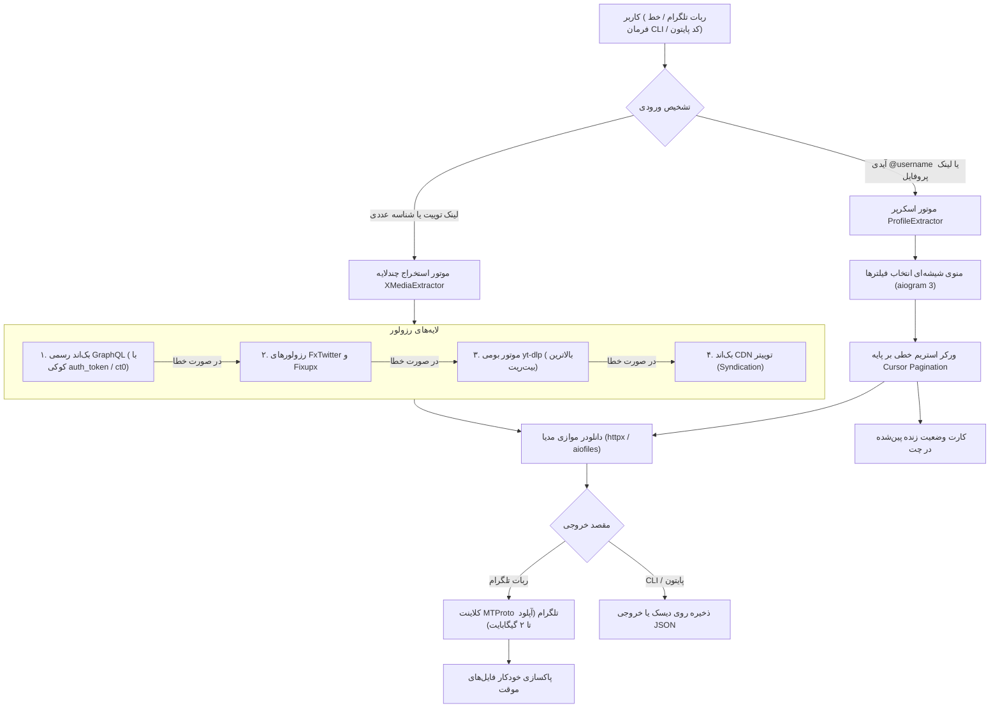

<div align="center">

# x2t

**موتور قدرتمند استخراج مدیا از توییتر (X)، اسکرپر تایم‌لاین پروفایل، و ربات تلگرام با قابلیت ارسال مستقیم فایل تا ۲ گیگابایت (MTProto).**

[](https://github.com/TheMRVX/x2t/actions/workflows/ci.yml)
[](LICENSE)


-7928CA?logo=speedtest&logoColor=white)


[بررسی اجمالی](#بررسی-اجمالی) •
[حالت‌های کاری](#حالت‌های-کاری) •
[معماری سیستم](#معماری-سیستم) •
[پیش‌نیازها](#پیش‌نیازها) •
[نصب و راه‌اندازی](#نصب-و-راه‌اندازی) •
[راهنمای استفاده](#راهنمای-استفاده) •
[دستورات ربات](#دستورات-ربات) •
[تنظیمات](#تنظیمات) •
[عیب‌یابی](#عیب‌یابی) •
[سوالات متداول](#سوالات-متداول) •
[لایسنس](#لایسنس)

<br/>

[English Documentation](README.md) • [راهنمای فارسی](README_FA.md)

</div>

---

## بررسی اجمالی

پروژه `x2t` یک موتور ماژولار و ربات تلگرام برای استخراج، دانلود و ارسال انواع مدیا (ویدیوهای با کیفیت 4K و 1080p، تصاویر با وضوح اصلی و گیف‌های تکرارشونده) از پست‌های تکی یا کل تایم‌لاین پروفایل‌های پلتفرم X (توییتر سابق) است.

ربات‌های استاندارد تلگرام به رابط HTTP Bot API وابسته هستند که خروجی فایل‌های ارسالی را به سقف ۵۰ مگابایت محدود می‌کند. `x2t` با تجمیع کلاینت بومی MTProto تلگرام (`Pyrogram` به همراه اکستنشن‌های شتاب‌یافته `TgCrypto`) این محدودیت را برطرف کرده و امکان آپلود مستقیم فایل تا **۲۰۰۰ مگابایت (۲ گیگابایت)** را با حداکثر سرعت شبکه فراهم می‌سازد، در حالی که رابط تعاملی ربات بر بستر `aiogram 3` اجرا می‌شود.

کاربردهای اصلی:

- **آرشیو مدیای با بیت‌ریت بالا:** دریافت ویدیوها و تصاویر اصلی با بالاترین کیفیت ممکن و بدون افت ناشی از فشرده‌سازی.
- **دانلود گروهی تایم‌لاین پروفایل:** اسکرپ خطی و چندصفحه‌ای تایم‌لاین با فیلترهای دقیق انتساب (حذف ریتوییت‌ها، نقل‌قول‌ها و ویدیوهای امبدشده از اکانت‌های دیگر).
- **ربات اختصاصی رسانه برای تیم‌ها و کاربران:** اجرای ربات تلگرام در حالت عمومی یا خصوصی با رهگیری زنده وضعیت دانلود و ارسال آلبومی (`MediaGroup`).
- **استفاده به عنوان ابزار خط فرمان یا کتابخانه پایتون:** امکان به‌کارگیری در اسکریپت‌ها و خطوط لوله پردازش داده مستقل.

> [!NOTE]
> استفاده از `x2t` برای محتوای عمومی نیازی به کلید رسمی API توییتر ندارد. برای محتوای حساس و دارای محدودیت سنی (NSFW)، امکان اتصال کوکی حساب کاربری از طریق فایل تنظیمات یا دستورات درون ربات فراهم است.

## حالت‌های کاری

| قابلیت | ربات تلگرام (`x2t.bot`) | خط فرمان CLI (`x2t`) | پکیج پایتون (`import x2t`) |
|---|---|---|---|
| **سقف آپلود فایل** | **۲۰۰۰ مگابایت (۲ گیگابایت)** با MTProto | محدود به فضای دیسک | وابسته به پیاده‌سازی کاربر |
| **رابط کاربری** | چت تلگرام با دکمه‌های شیشه‌ای | ترمینال (خروجی متنی Rich یا JSON) | توابع ناهمگام (Async) و همگام (Sync) |
| **اسکرپر پروفایل** | منوی فیلتر تعاملی + وضعیت پین‌شده | استریم مستقیم به ترمینال/فایل | ژنراتور ناهمگام (`iter_profile_media_tweets_stream`) |
| **دسته‌بندی مدیا** | آلبوم‌های بومی تلگرام (`MediaGroup`) | دسته‌های فایلی روی دیسک | مدل‌های ساختاریافته Pydantic |
| **مدیریت فضای دیسک** | پاکسازی خودکار فایل‌ها بلافاصله پس از آپلود | ذخیره پایدار در دایرکتوری انتخابی | در حافظه یا مسیر دلخواه |
| **پایگاه داده و آمار** | SQLite (حالت WAL) با دستورات `/stats` و `/history` | بدون نیاز به دیتابیس | بدون نیاز به دیتابیس |

## معماری سیستم


```mermaid
flowchart TD
    User["کاربر (ربات تلگرام / خط فرمان CLI / کد پایتون)"] --> Router{"تشخیص ورودی"}
    
    %% استخراج تک پست
    Router -->|"لینک توییت یا شناسه عددی"| SingleEngine["موتور استخراج چندلایه XMediaExtractor"]
    subgraph Cascade ["لایه‌های رزولور"]
        B1["۱. بک‌اند رسمی GraphQL (با کوکی auth_token / ct0)"]
        B2["۲. رزولورهای FxTwitter و Fixupx"]
        B3["۳. موتور بومی yt-dlp (بالاترین بیت‌ریت)"]
        B4["۴. بک‌اند CDN توییتر (Syndication)"]
        B1 -->|در صورت خطا| B2
        B2 -->|در صورت خطا| B3
        B3 -->|در صورت خطا| B4
    end
    SingleEngine --> Cascade
    Cascade --> DL["دانلودر موازی مدیا (httpx / aiofiles)"]
    
    %% استخراج پروفایل
    Router -->|"آیدی @username یا لینک پروفایل"| ProfileEngine["موتور اسکرپر ProfileExtractor"]
    ProfileEngine --> FilterUI["منوی شیشه‌ای انتخاب فیلترها (aiogram 3)"]
    FilterUI --> StreamWorker["ورکر استریم خطی بر پایه Cursor Pagination"]
    StreamWorker --> PinnedUI["کارت وضعیت زنده پین‌شده در چت"]
    StreamWorker --> DL
    
    %% تحویل خروجی
    DL --> Delivery{"مقصد خروجی"}
    Delivery -->|"ربات تلگرام"| MTProto["کلاینت MTProto تلگرام (آپلود تا ۲ گیگابایت)"]
    Delivery -->|"CLI / پایتون"| Disk["ذخیره روی دیسک یا خروجی JSON"]
    MTProto --> Cleanup["پاکسازی خودکار فایل‌های موقت"]
```

خلاصه عملکرد: ورودی به عنوان تک‌پست یا پروفایل دسته‌بندی می‌شود. تک‌پست‌ها از یک زنجیره چندمرحله‌ای (GraphQL → FxTwitter → yt-dlp → Syndication) عبور می‌کنند تا نرخ پایداری دانلود در بالاترین حد ممکن حفظ شود. فایل‌ها به شکل همزمان دانلود شده و سپس مستقیماً از طریق پروتکل بومی MTProto تلگرام به چت یا کانال آپلود می‌شوند.

ساختار مخزن:

```
x2t/
├── x2t/
│   ├── bot/             هندلرهای ربات تلگرام، کیبوردهای شیشه‌ای و آپلودر MTProto با Pyrogram
│   ├── core/            بک‌اندهای استخراج مدیا (GraphQL, FxTwitter, yt-dlp) و موتور دانلود
│   ├── utils/           دیتابیس ناهمگام SQLite (حالت WAL)، کش حافظه موقت و ابزارهای کمکی
│   ├── __init__.py      توابع و مدل‌های عمومی پکیج پایتون
│   ├── __main__.py      نقطه ورود خط فرمان با فرمت‌بندی غنی (Rich)
│   ├── config.py        تنظیمات پروژه و مدیریت متغیرهای محیطی با Pydantic
│   ├── exceptions.py    سلسله‌مراتب خطاهای اختصاصی
│   ├── logger.py        سیستم لاگینگ ساختاریافته
│   └── models.py        مدل‌های داده‌ای Pydantic (PostMediaResult, MediaItem, ProfileFilterOptions)
├── docker-compose.yml   تنظیمات داکر کامپوز برای اجرای در پروداکشن
├── Dockerfile           ایمیج استاندارد شامل وابستگی‌های سیستمی و FFmpeg
├── pyproject.toml       مشخصات و وابستگی‌های پکیج پایتون (PEP 621)
└── requirements.txt     فهرست وابستگی‌های پروژه
```

## پیش‌نیازها

- **پایتون:** نسخه ۳.۱۰، ۳.۱۱ یا ۳.۱۲ (نسخه ۶۴ بیتی)
- **ابزار FFmpeg:** نصب‌شده و در دسترس در متغیر محیطی `PATH`
- **مشخصات تلگرام:**
  - توکن ربات (`BOT_TOKEN`) از طریق [@BotFather](https://t.me/BotFather)
  - شناسه‌های `API_ID` و `API_HASH` از طریق پنل [my.telegram.org](https://my.telegram.org) (جهت فعال‌سازی آپلود ۲ گیگابایتی)

## نصب و راه‌اندازی

### ۱. کلون کردن مخزن

```bash
git clone https://github.com/TheMRVX/x2t.git
cd x2t
```

### ۲. نصب پکیج و وابستگی‌ها

ایجاد محیط مجازی و نصب پروژه:

```bash
python3 -m venv .venv
source .venv/bin/activate  # در ویندوز: .venv\Scripts\activate

pip install --upgrade pip
pip install -e .
```

اطمینان از نصب FFmpeg روی سیستم:

```bash
# اوبونتو / دبیان
sudo apt update && sudo apt install -y ffmpeg

# مک‌اواس (Homebrew)
brew install ffmpeg

# آرچ لینوکس
sudo pacman -S ffmpeg
```

### ۳. تنظیم متغیرهای محیطی

یک کپی از فایل نمونه ایجاد کنید:

```bash
cp .env.example .env
```

فایل `.env` را باز کرده و مقادیر لازم را پر کنید:

```env
# تنظیمات ربات تلگرام (الزامی)
BOT_TOKEN=your_bot_token_here
API_ID=your_api_id_here
API_HASH=your_api_hash_here

# کنترل دسترسی
IS_PRIVATE=true
ADMIN_IDS=[123456789]
ALLOWED_USER_IDS=[]

# مسیر دیتابیس و فایل‌های موقت
DB_PATH=bot_database.sqlite3
TEMP_DOWNLOAD_DIR=./downloads/temp_bot
RATE_LIMIT_SECONDS=1.0

# اختیاری: کوکی احراز هویت توییتر برای محتوای حساس و NSFW
TWITTER_AUTH_TOKEN=
TWITTER_CT0=

# اختیاری: فرمت کپشن (true = فقط متن خالص بدون دکمه و نام نویسنده)
CLEAN_CAPTION=false
```

## راهنمای استفاده

### اجرای ربات تلگرام

**اجرای مستقیم:**

```bash
python -m x2t.bot.main
```

**اجرا با داکر کامپوز (محیط پروداکشن):**

```bash
docker compose up -d --build
```

مشاهده لاگ‌های زنده کانتینر:

```bash
docker compose logs -f
```

---

### استفاده از طریق خط فرمان (CLI)

این پکیج یک دستور ترمینال به نام `x2t` در اختیار شما قرار می‌دهد:

```bash
# بررسی لینک‌های مدیا و مشخصات پست بدون دانلود فایل
x2t "https://x.com/NASA/status/1835700854378123456"

# دانلود مستقیم تمام فایل‌های مدیا در یک پوشه دلخواه
x2t "https://x.com/NASA/status/1835700854378123456" --download --output ./downloads

# خروجی داده‌های متادیتا به فرمت ساختاریافته JSON
x2t "https://x.com/NASA/status/1835700854378123456" --json

# استفاده از فایل کوکی برای توییت‌های دارای محدودیت
x2t "https://x.com/username/status/1234567890" --download --cookies cookies.txt
```

---

### استفاده به عنوان کتابخانه پایتون (SDK)

می‌توانید قابلیت‌های `x2t` را مستقیماً در پروژه‌های پایتون خود فراخوانی کنید:

#### استخراج و دانلود تک‌پست

```python
import x2t

# ۱. دریافت لینک‌ها و مشخصات بدون دانلود فایل
result = x2t.extract_media("https://x.com/NASA/status/1835700854378123456")
print(f"نویسنده: {result.author_name} (@{result.author_username})")
print(f"تعداد مدیا: {result.media_count}")

for item in result.items:
    print(f" - [{item.type.value.upper()}] {item.resolution or 'N/A'} -> {item.url}")

# ۲. دانلود کامل فایل‌ها روی دیسک
downloaded = x2t.download_media(
    "https://x.com/NASA/status/1835700854378123456",
    output_dir="./downloads"
)
for item in downloaded.items:
    print(f"ذخیره شد: {item.local_path} ({item.size_bytes} بایت)")
```

#### دانلود ناهمگام (Async)

```python
import asyncio
import x2t

async def main():
    result = await x2t.download_media_async(
        "https://x.com/NASA/status/1835700854378123456",
        output_dir="./downloads"
    )
    print(f"تعداد {result.media_count} آیتم با موفقیت به صورت Async دانلود شد.")

asyncio.run(main())
```

#### اسکرپ جریانی تایم‌لاین پروفایل

```python
import asyncio
from x2t.core.profile_extractor import profile_extractor
from x2t.models import ProfileFilterOptions

async def archive_timeline():
    # تنظیم فیلترهای دقیق محتوا
    options = ProfileFilterOptions(
        include_videos=True,
        include_photos=True,
        include_gifs=True,
        include_retweets=False,        # حذف ریتوییت‌ها
        include_sourced_media=False,   # حذف ویدیوهای شخص ثالث (From @other)
        include_quotes=False,          # حذف توییت‌های نقل‌قول
        limit=50,                      # ۰ = نامحدود
    )

    async for post in profile_extractor.iter_profile_media_tweets_stream("NASA", options):
        print(f"پست {post.tweet_id}: {len(post.media_items)} مدیا یافت شد")
        for item in post.media_items:
            print(f"  -> {item.type.value}: {item.url}")

asyncio.run(archive_timeline())
```

## دستورات ربات

| دستور | سطح دسترسی | توضیحات |
|---|---|---|
| `/start` | عمومی | پیام شروع، معرفی قابلیت‌ها و راهنمای کار با ربات |
| `/history` | عمومی | نمایش ۵ دانلود اخیر کاربر به همراه لینک مستقیم |
| `/help` | عمومی | راهنمای کامل استفاده و حل مشکلات متداول |
| `/about` | عمومی | اطلاعات معماری، نسخه و مشخصات فنی سیستم |
| `/mode [private\|public]` | ادمین | مشاهده یا تغییر وضعیت دسترسی به حالت عمومی یا خصوصی |
| `/caption [clean\|full]` | ادمین | تغییر استایل کپشن بین حالت ساده و کارت کامل اطلاعات |
| `/stats` | ادمین | نمایش تعداد کل کاربران، آمار دانلودها و سلامت سیستم |
| `/allow <user_id>` | ادمین | اعطای دسترسی به شناسه کاربر در حالت خصوصی |
| `/disallow <user_id>` | ادمین | لغو دسترسی کاربر مجاز قبلی |
| `/set_cookie <auth_token>` | ادمین | ثبت کوکی احراز هویت توییتر برای بازگشایی محتوای حساس |
| `/broadcast <message>` | ادمین | ارسال پیام همگانی به تمام کاربران ثبت‌شده ربات |

## تنظیمات

تمام پارامترها از طریق فایل `.env` یا متغیرهای محیطی سیستم قابل مقداردهی هستند:

| پارامتر | نوع | الزامی | مقدار پیش‌فرض | توضیحات |
|---|---|---|---|---|
| `BOT_TOKEN` | رشته | **بله** | — | توکن ربات تلگرام دریافت‌شده از [@BotFather](https://t.me/BotFather) |
| `API_ID` | عدد | **بله** | — | شناسه API تلگرام از پنل [my.telegram.org](https://my.telegram.org) |
| `API_HASH` | رشته | **بله** | — | هش API تلگرام از پنل [my.telegram.org](https://my.telegram.org) |
| `IS_PRIVATE` | بولین | خیر | `false` | محدودسازی استفاده به `ADMIN_IDS` و `ALLOWED_USER_IDS` |
| `ADMIN_IDS` | آرایه JSON | خیر | `[]` | فهرست شناسه‌های عددی ادمین‌های ربات |
| `ALLOWED_USER_IDS` | آرایه JSON | خیر | `[]` | فهرست شناسه‌های عددی کاربران مجاز در حالت خصوصی |
| `TWITTER_AUTH_TOKEN` | رشته | خیر | — | کوکی `auth_token` توییتر برای دسترسی به محتوای حساس و NSFW |
| `TWITTER_CT0` | رشته | خیر | — | توکن ضد جعل CSRF توییتر (`ct0`) |
| `CLEAN_CAPTION` | بولین | خیر | `false` | ارسال کپشن به صورت متن ساده بدون مشخصات نویسنده و دکمه |
| `DB_PATH` | مسیر | خیر | `bot_database.sqlite3` | مسیر فایل پایگاه داده SQLite (با حالت همزمانی WAL) |
| `TEMP_DOWNLOAD_DIR` | مسیر | خیر | `./downloads/temp_bot` | دایرکتوری ذخیره فایل‌های موقت در زمان آپلود MTProto |
| `RATE_LIMIT_SECONDS` | اعشاری | خیر | `1.0` | وقفه کنترل نرخ درخواست کاربران بر حسب ثانیه |

## عیب‌یابی

| مشکل | علت احتمالی | راه‌حل |
|---|---|---|
| خطای `FloodWait` هنگام آپلود | محدودیت نرخ موقت تلگرام بر روی کلاینت MTProto | ربات مدت زمان صبر را به صورت خودکار مدیریت می‌کند؛ از دانلود همزمان انبوه در چت‌های متعدد خودداری فرمایید. |
| خطای استخراج در توییت‌های حساس | الزام ورود به حساب کاربری برای محتوای حساس توییتر | مقدار `TWITTER_AUTH_TOKEN` را در فایل `.env` وارد کنید یا با دستور `/set_cookie` در ربات ثبت نمایید. |
| خطای عدم شناسایی FFmpeg | نصب نبودن ابزار FFmpeg در سیستم | بسته FFmpeg را از طریق پکیج‌منیجر سیستم‌عامل نصب کرده و از دسترسی به آن در `PATH` اطمینان حاصل کنید. |
| ربات به پیام‌های کاربران پاسخی نمی‌دهد | فعال بودن حالت خصوصی (`IS_PRIVATE=true`) | آیدی کاربر را به `ALLOWED_USER_IDS` اضافه کنید یا از دستور `/allow <user_id>` استفاده نمایید. |
| اسکرپر پروفایل خروجی ندارد | حساب کاربری قفل (Private) یا معلق شده است | در دسترس بودن پروفایل را مستقیماً در مرورگر بررسی نمایید؛ برای اکانت‌های خاص توکن ورود الزامی است. |

## سوالات متداول

**چرا علاوه بر `BOT_TOKEN` نیاز به `API_ID` و `API_HASH` وجود دارد؟**  
رابط استاندارد Bot API تلگرام آپلود فایل‌ها را به ۵۰ مگابایت محدود کرده است. با اتصال به پروتکل مستقیم MTProto تلگرام از طریق `API_ID` و `API_HASH`، ارسال فایل‌ها تا سقف ۲۰۰۰ مگابایت (۲ گیگابایت) ممکن می‌شود.

**آیا استفاده از ربات به اشتراک توسعه‌دهندگان پولی توییتر نیاز دارد؟**  
خیر. پکیج `x2t` از اینترفیس‌های عمومی، رزولورهای FxTwitter و انجین yt-dlp برای دریافت فایل‌ها استفاده می‌کند و نیازی به پلن پولی توییتر ندارد.

**آیا در دانلودهای طولانی فضای دیسک سرور پر می‌شود؟**  
خیر. تمام فایل‌های موقت بلافاصله پس از تکمیل آپلود به تلگرام، به طور خودکار از مسیر `TEMP_DOWNLOAD_DIR` حذف می‌شوند.

**آیا امکان استفاده از ربات در گروه‌ها و کانال‌ها وجود دارد؟**  
بله. با تنظیم `IS_PRIVATE=false` دسترسی عمومی فراهم است، یا می‌توانید در حالت خصوصی فقط کاربران مدنظرتان را مجاز فرمایید.

## مشارکت

ارسال گزارش اشکال، پیشنهادات و پول ریکوئست‌ها مورد استقبال است.

۱. مخزن را فورک کنید.  
۲. برنچ جدیدی بسازید (`git checkout -b feat/my-feature`).  
۳. تغییرات را بر اساس استاندارد [Conventional Commits](https://www.conventionalcommits.org/) کامیت کنید (`git commit -m "feat: add feature"`).  
۴. تست‌ها را اجرا کنید (`pytest tests/`).  
۵. پول ریکوئست را ارسال نمایید.

## لایسنس

این پروژه تحت مجوز **GNU Affero General Public License v3.0 or later** (`AGPL-3.0-or-later`) منتشر شده است. متن کامل در فایل [LICENSE](LICENSE) موجود است.
